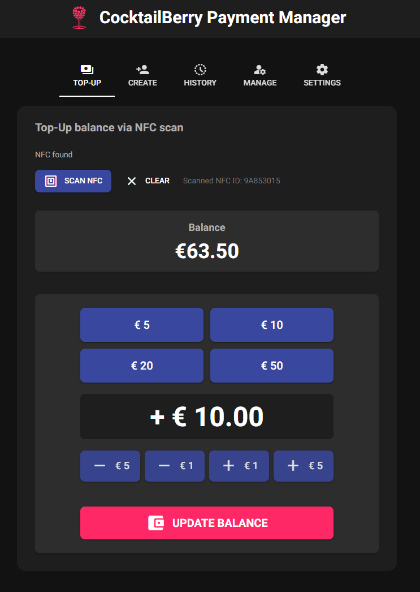
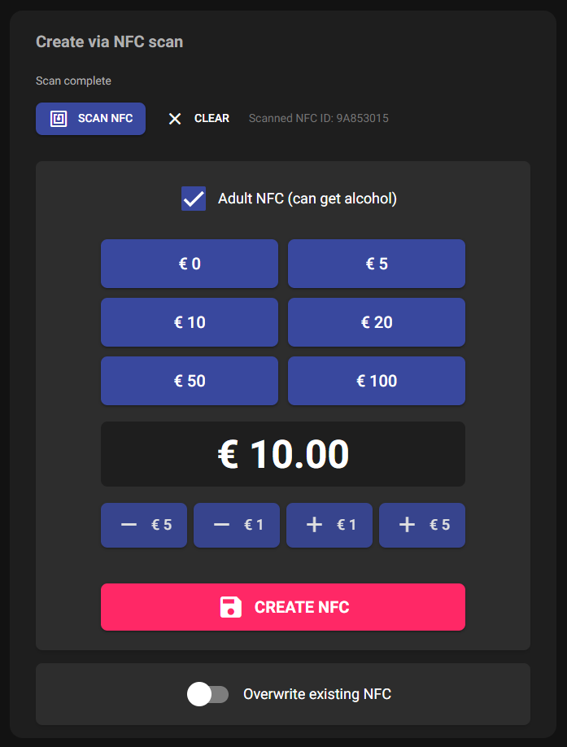
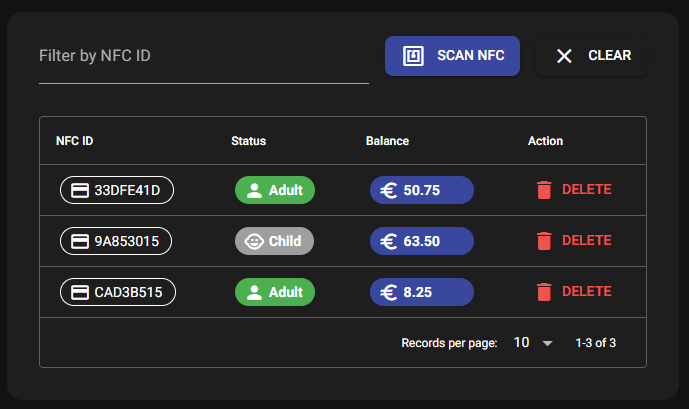
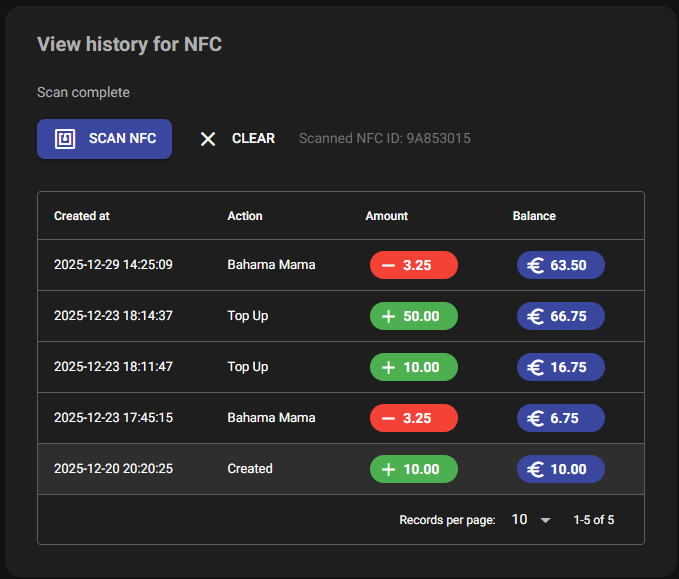

# CocktailBerry-Payment

Payment Service for [CocktailBerry](https://github.com/AndreWohnsland/CocktailBerry).
This service enables payment options for CocktailBerry, allowing users to integrate payment and balance management over NFC.
It is the central management point for service personal to initialize and manage user accounts, balances and transactions.


<br/>


[](https://cocktailberry.readthedocs.io)
[](https://sonarcloud.io/summary/new_code?id=AndreWohnsland_CocktailBerry)


[](https://www.buymeacoffee.com/AndreWohnsland)

CocktailBerry is a Python and Qt (or React for v2) based app for a cocktail machine on the Raspberry Pi.
It enables you to build your own, fully customized machine, while still be able to use the identical software on each machine.
Detailed information, installation steps and SetUp can be found at the [Official Documentation](https://docs.cocktailberry.org).

## Features

CocktailBerry-Payment is an optional extension to CocktailBerry, providing the following features:

- NFC based payment system and user privileges (e.g. age/alcohol restrictions)
- User account management and top-up functionality

Below is a high-level schema of how the service integrates with CocktailBerry and other components.


The service consists of two main components:

1. **Backend API**:
A RESTful API built with FastAPI, responsible for handling all payment-related operations, user management, and database interactions.
Only one instance of this should be used to have consistent data.
2. **Frontend GUI**:
Management Admin application for owners to create and top up nfc chips/cards.
You can use as many instances as you want.
While you can run it on the same device as the backend, it is recommended to run it on a separate device for better performance and security.

CocktailBerry Machines using the payment option will communicate with the backend API to process payments and manage user balances.
This requires the machines being either on the same network or having access to the backend API over the internet.
User will then pay the cocktails over NFC cards, while service personal can manage the users and top up balances via the GUI separately.

## Setup

See a detailed step-by-step installation guide in the [Official Documentation](https://docs.cocktailberry.org/payment/#setup).
There you will find setup steps for windows and unix systems.

### Service installation

Make sure you have followed the preparation steps for your OS.
After that you should already be in the CocktailBerry-Payment folder.
You can use:

```bash
uv run -m cocktailberry.setup
```

to start the interactive setup.
You will be prompted for all necessary information and the script will set up everything for you.
You might need to restart your device after the installation is done, depending on the options you selected and your OS.

## Impressions of Admin GUI









## Development

This project uses [uv](https://docs.astral.sh/uv/) to manage all its dependencies.
To get started, you need to install uv and then install the dependencies.

```bash
uv sync --all-extras
```

We also use pre-commits to check the code style and run some tests before every commit.
You can install them with:

```bash
uv run pre-commit install --install-hooks
```

This will install all dependencies and you can start developing.
Then just run:

```bash
uv run -m cocktailberry.api
```

for the backend.
You can run the user management with:

```bash
uv run -m cocktailberry.gui
```

in another terminal.

### Open Tasks

Here you will find planned features and tasks for future releases.
